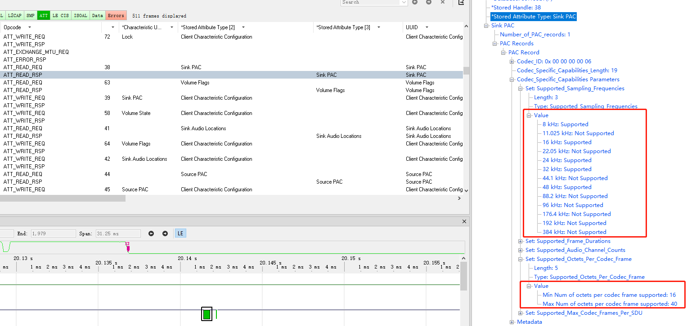

# TCL_LE_AUDIO_GAF
iso的服务

https://github.com/zephyrproject-rtos/zephyr

Releases: https://github.com/zephyrproject-rtos/zephyr/releases

https://github.com/zephyrproject-rtos/zephyr/releases/tag/v3.3.0

目前的le audio的GAF，可以参考zephyr

BAP 上传只是我写部分参考，提供我外网查看，原版可以直接查看开源的zephyr

LC3的压缩率大概是8倍左右，pac可以设置支持的帧长，对端手机可以选择对应的采样率

通道1 1S传输LC3编码 40 * 1000ms/10ms = 4000字节

播放所需数据 16K采样率 16位深  16000 * 2 = 32000字节

32000 / 4000  = 8 

8倍压缩率  大概

